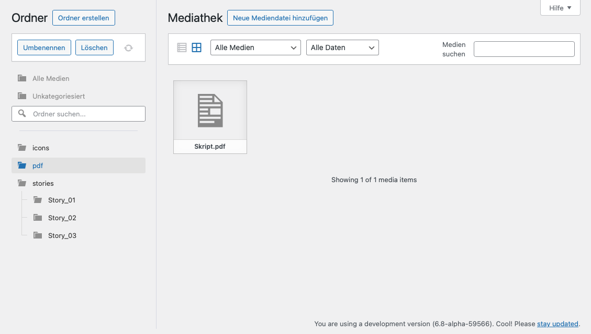

# wp-plugin-directory-access

While common WordPress plugins for media management only group files virtually,
this plugin enables filesystem-based arrangement without any need for additional database entities.

## Features

- Create, rename, move and delete directories.
- Scan directories and import files from the filesystem into the WordPress media library.
- Upload files into specific directories.
- WordPress-native look and feel.

> ⚠️ **Warning**: This plugin does not provide access control, i.e.,
> every user can access every directory.
